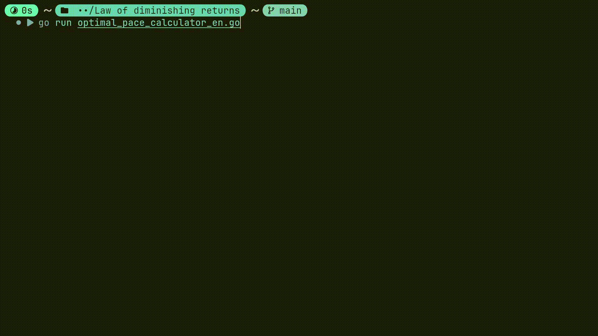

# 🚀 Optimal Pace Calculator (Go Edition) 🚀

A simple Go command-line tool to visualize your progress on a large task and find your "balance point" — the optimal pace where increasing your effort gives diminishing returns. 📉

This tool helps you answer the question: "Is doing 5 pages a day *that* much better than 4?"

## 🤔 The Problem (Diminishing Returns)

Imagine you need to learn 1,000 words.
* At 1 word/day: 1,000 days.
* At 2 words/day: 500 days (You save **500** days! 😱)
* At 3 words/day: 334 days (You save **166** days.)
* ...
* At 10 words/day: 100 days.
* At 11 words/day: 91 days (You save **9** days. 😑)

Going from 1 to 2 words/day is a *massive* win. Going from 10 to 11 is much less significant, but the effort is the same. This tool helps you see this "balance point" for your own tasks.

## ✨ Features

* **Task Volume:** Define any task (pages, words, hours, etc.). 🎯
* **Weekend/Off-day Calculation:** Accurately calculates the *calendar* time by factoring in your weekly days off. 🌴
* **Current Pace Highlight:** Marks your current pace in the list so you can easily compare. 📍
* **Text Report:** A clear console table showing your pace, the total days, and the "days saved" from the previous step. 📊
* **Multi-Language:** This repo provides two separate `.go` files for English (`_en.go`) and Russian (`_ru.go`).

## ⚙️ How to Use

1.  Go to the [**Releases Page**](https://github.com/XPLassal/optimal-pace-calculator/releases) (Я буду использовать 'optimal-pace-calculator' как имя репозитория. Если у вас другое, измените ссылку).
2.  Download the executable file for your operating system (e.g., `PaceCalculator_EN.exe` for Windows).
3.  Run the file from your terminal.

## 💾 Downloads

You can download the latest compiled executables from the [**Releases**](https://github.com/XPLassal/optimal-pace-calculator/releases) page.
